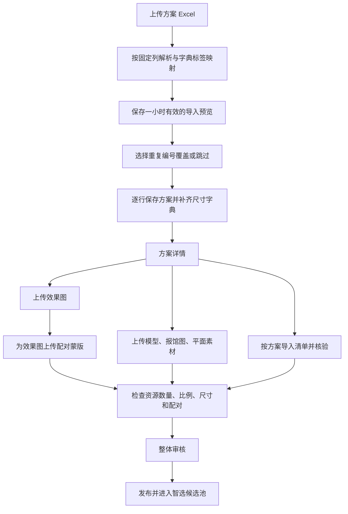

# 管理后台方案导入与资源关联审查报告

审查日期：2026-10-09。

## 1. 结论与范围

当前链路具备导入预览、重复编号策略、版本冲突保护、资源文件版本、遮罩配对、审核与发布门禁，但存在会影响实际操作的缺陷。主要集中在：方案上下文丢失、导入结果漏报、母子方案导入顺序依赖，以及资源上传成功后才发现配对规格不满足发布条件。

本轮记录 **9 项缺陷（P2：8 项，P3：1 项）及 7 项优化建议**。其中 B03–B07 已有针对性运行复现，B08 的方案上传超限行为也已运行验证；其他项由源码执行路径确认。现有服务端 417 项测试、管理端 56 项测试均通过，这说明现有回归集通过，不代表下述缺陷不存在。

本报告覆盖：

- 方案列表 Excel 解析、预览、提交、重复处理和错误导出。
- 方案详情到效果图、蒙版、报馆图、平面素材的跳转和方案选择。
- 资源上传、替换、排序、删除，以及效果图与蒙版的关系。
- 模型上传、清单导入关联，以及上述变更对审核、发布的影响。
- 相关 API、数据库约束、权限依赖与现有测试。

未覆盖外部 SSO 的真实登录、真实浏览器逐项操作、AI 生成任务及客户成交链路。下文区分“源码确认”和“运行复现”；源码确认不代表已完成浏览器端到端验证。此轮交付审查文档，未修改业务实现。

## 2. 当前流程

方案 Excel 只写基础信息，不自动导入图片或按文件名建立资源关系。资源通过 `schemeCode` 找到方案，最终以 `scheme_id` 关联；蒙版通过 `related_asset_id` 关联同方案的效果图。清单导入额外登记 `checklist` 源文件资产，并设置 `scheme_boms.source_asset_id`。

发布要求包括恰好 3 张效果图、3 张蒙版、逐一配对、配对排序一致、像素尺寸一致，以及效果图严格为 16:9。还需模型、报馆图、平面素材、已核验清单及当前修订的整体审核通过记录。上传成功不等于可发布。

## 3. 已确认缺陷

严重性：P1 为高影响功能或数据问题；P2 为一般功能、边界或稳定性问题；P3 为低影响展示问题。各项优先级与运行验证状态见后文。

| 编号 | 级别 | 问题 | 主要影响 |
| --- | --- | --- | --- |
| B01 | P2 | 资源页面丢失方案上下文 | 进入全局列表，需重新选归属方案 |
| B02 | P2 | 名称搜索实际只查编号 | 找不到已存在方案 |
| B03 | P2 | 导入最终失败明细漏掉预览错误 | 统计与错误导出不完整 |
| B04 | P2 | 母子方案依赖文件行顺序 | 合法子方案写入失败 |
| B05 | P2 | 上传与发布图片规格不一致 | 上传成功后无法发布 |
| B06 | P2 | 删除效果图遗留活动蒙版 | 预览、排序受阻，需修复配对 |
| B07 | P3 | 多工作表来源与行号丢失 | 无法准确定位原始错误行 |
| B08 | P2 | 上传大小前后端限制不一致 | 10–20MB 文件无法按承诺处理 |
| B09 | P2 | 配对候选异步回包无保护 | 切换方案后出现过期候选 |

下文省略前缀的 `views/...` 路径相对于 `apps/admin/apps/web-antd/src/`，`imports/...` 路径相对于 `apps/server/src/modules/schemes/`，`modules/...` 路径相对于 `apps/server/src/`。行号为审查时定位，后续修改可能使其偏移。

### B01 · P2：方案详情跳转资源管理后，归属方案上下文丢失

**证据：源码确认。**

- `apps/admin/apps/web-antd/src/views/scheme/detail/index.vue:995` 等四处跳转携带 `?schemeCode=...`。
- `views/assets/renderings/index.vue:48`、`masks/index.vue:51`、`venue-materials/index.vue:45`、`artworks/index.vue:45` 仅加载方案选项，没有读取路由查询参数。
- 各资源 `options.ts` 没有从路由初始化筛选；上传弹窗 `open()` 也不接收方案编号。

**触发方式：**打开方案 A 的资产汇总，点击“效果图”或“蒙版”。页面展示全局资源列表；点击上传后还要重新选择方案。

**影响：**入口表达的是维护当前方案，但落地页丢失上下文，增加选错方案、误改其他方案资源的机会。服务端仍按实际提交的方案编号关联，不是服务端随机串关联。

**建议：**读取并监听 `route.query.schemeCode`，在首轮查询前初始化筛选；上传弹窗默认使用当前筛选方案并清晰展示归属。详情跳转使用 `{ path, query: { schemeCode } }`，避免编号中 `&`、`#` 等字符破坏查询串。

**验收：**从 A 进入四类资源页面，首轮请求均筛选 A；上传默认 A；从 A 切换到 B 以及浏览器前进后退后筛选仍正确。

### B02 · P2：资源选择框提示支持名称搜索，实际只搜索编号

**证据：源码确认。**

- `views/assets/renderings/components/UploadModal.vue:25` 发送 `{ code: keyword }`，但第 178 行提示“搜索方案编号或名称”。
- 蒙版、报馆图、平面素材的上传及列表筛选沿用同样写法。
- `apps/server/src/modules/schemes/service.ts:165`、`:166` 分别对 `code`、`name` 建立查询条件；`code` 不会搜索名称。

**触发方式：**已有方案编号 `S-001`、名称“科技展台”，输入“科技展台”。若编号不包含该词，结果为空。

**建议：**提供明确的关键词查询，以编号或名称匹配；不要同时传 `code` 和 `name`，现有实现会用 AND 组合。若暂不支持名称检索，则同步修改提示文案。

**验收：**输入完整或部分编号、完整或部分名称均能选中目标方案，空输入保留默认分页行为。

### B03 · P2：预览错误行未进入最终失败明细，结果统计不完整

**证据：源码确认及真实数据库运行复现，详见第 6 节。**

- `apps/server/src/modules/schemes/imports/commit.ts:105` 的 `rowsToCommit()` 直接过滤 `status=error` 的行。
- 第 136 行将 `failed` 初始化为空，只在实际写入阶段填入失败。
- `views/scheme/list/components/SchemeImportModal.vue:281` 显示 `commitResult.failed.length`；第 134 行导出也只使用该数组。

**触发方式：**Excel 包含 1 行合法数据、1 行缺少名称的数据。预览显示错误；点击确认后结果中的“失败”没有包含该错误行，失败文件也无法完整导出它。全部错误时仍能进入提交结果。

**影响：**使用者不能从最终结果解释原始文件中每一行的去向，容易误认为已处理完全部数据。

**建议：**结果分别返回新增、更新、重复跳过、预览校验失败、写入失败与空行跳过；保留完整行定位和原因。没有可提交行时禁用确认导入。

**验收：**混合新增、重复、错误、空行的文件最终统计闭合；错误导出包含预览错误和写入错误；重复跳过不计入失败。

### B04 · P2：同批母子方案导入依赖 Excel 行顺序

**证据：真实数据库运行复现，并有母方案在前的成功对照，详见第 6 节。**

- `apps/server/migrations/003_schemes.sql:18` 的 `parent_code` 是立即校验的外键。
- `imports/preview.ts:35` 仅做尺寸、字典等校验，没有建立同批父子关系依赖。
- `imports/commit.ts:139` 按预览顺序逐行写入，失败后仅回滚当前行，不在母方案创建后重试子方案。

**触发方式：**数据库中 A、B 都不存在；第 2 行是子方案 B，`parentCode=A`；第 3 行是母方案 A。预览可把两行都标为新增，提交时 B 报“母方案不存在”，A 成功。

**建议：**预览校验父方案是否存在于数据库或本次有效行中；提交按依赖顺序写入，同时明确检测循环、自引用以及父方案被跳过/写入失败的情况。

**验收：**合法母子方案任意行顺序均可导入；不存在或循环的父子关系在预览中准确定位；选择部分行时仍验证依赖。

### B05 · P2：图片上传、替换与发布规格校验不一致

**证据：真实图片、组件校验回调及发布校验函数运行复现；未执行浏览器组件测试，详见第 6 节。**

- 效果图 `UploadModal.vue:75` 接受与 16:9 差值不超过 `0.02` 的图片。
- `apps/server/src/modules/schemes/readiness.ts:146` 要求 `widthPx * 9 === heightPx * 16`，没有容差。
- `apps/server/src/modules/assets/upload.ts:39` 仅验证可识别的图片及 MIME，没有校验 16:9 或蒙版与效果图像素一致。
- `views/assets/renderings/index.vue:74`、`masks/index.vue:90` 的替换入口不执行配对尺寸校验。

**触发方式：**上传 1600×901 效果图，前端比例校验通过；补齐其余资产后仍因规格不符无法发布。或者为 1600×900 效果图上传 800×450 蒙版，也能先保存，最后才发现不满足发布条件。

**建议：**明确采用严格 16:9 后，上传和替换统一执行相同校验。上传蒙版时展示对应效果图的像素尺寸并提前校验；替换效果图影响已有蒙版时明确提示，提供成对替换流程或在提交前阻断。

**验收：**1600×900 可通过；1600×901 在上传阶段给出具体原因；错尺寸蒙版不能悄悄保存为正常配对；替换与首次上传规则一致。

### B06 · P2：删除效果图后保留指向失效资源的活动蒙版

**证据：真实数据库调用生产创建、删除服务复现，详见第 6 节。**

- `apps/server/src/modules/assets/service.ts:122` 的删除流程仅把目标资产设为 `is_active=false`。
- `migrations/004_assets.sql:7` 的 `ON DELETE SET NULL` 仅适用于物理删除，不处理软删除。
- `views/assets/masks/index.vue:75` 从活动效果图中寻找配对对象，找不到时提示“未找到配对的效果图数据”。
- `modules/assets/pairing.ts:96` 会在蒙版更新时检查所关联效果图仍然活动，因此残留蒙版修改排序也会受阻。

**触发方式：**建立效果图 R 和蒙版 M 的配对，删除 R。M 仍在蒙版列表中，预览失败，常规页面没有重新配对操作。

**建议：**删除前查询配对影响。可以阻止删除并引导先解除/替换关联，或经明确确认后事务性处理整对资源；同时提供重新配对入口。不要仅依赖发布门禁发现问题。

**验收：**不会出现页面无法处理的活动孤立蒙版；删除提示说明影响；恢复配对后可预览、排序和重新审核。

### B07 · P3：多工作表导入丢失工作表名称，后续工作表行号错误

**证据：真实多工作表 XLSX 与数据库预览运行复现，详见第 6 节。**

- `imports/workbook.ts:97` 遍历多个工作表，但仅保存解析数据。
- `imports/preview.ts:21` 使用合并数组的 `index + 2` 作为行号。

**触发方式：**两个工作表各在第 2 行放一条方案，第二个工作表中的方案被报告为“第 3 行”，且看不到工作表名称。工作表越多偏差越大。

**建议：**解析阶段保留 `sheetName`、`sourceRowNumber`，使用独立行 ID 作为选择键；预览和错误导出均展示来源。或者明确只允许单个数据工作表并在解析前校验。

**验收：**跨工作表的重复编号、校验失败、写入失败都能定位到原文件的准确工作表和行号。

### B08 · P2：导入大小限制不一致，方案导入还会继续处理截断内容

**证据：源码配置确认；方案导入生产路由及资源 multipart 路径已运行验证。**

- `SchemeImportModal.vue:121` 与 `BomImportModal.vue:121` 均允许 20MB。
- `apps/server/src/app.ts:47` 注册 multipart 时设置 `fileSize: 10 * 1024 * 1024`。
- 方案导入、清单导入未在相关入口提供相应的 20MB 覆盖配置。

**触发方式：**选择 10–20MB 的有效工作簿。前端允许进入请求，后端不能按界面承诺完整处理该文件。

**实测补充：**为有效 XLSX 附加尾部补零得到 11MiB 文件，生产方案导入路由仅消费 10MiB，但截断内容仍可解析，返回 200 并保存预览。该样本截掉的是补零，不能证明正常超大工作簿的业务行已经丢失。对照的资源上传 `request.parts()` 路径返回 413，存储和版本写入均为 0，未复现“模型文件截断后保存”。清单超限仅确认配置与前端限制不一致，未单独动态复现其路由。

**建议：**按业务需要统一限制及文案；超限明确返回文件大小错误，前端不要统一显示为“文件解析失败”。手动消费上传流的入口也应显式处理截断状态，不能把部分内容交给后续保存。

**验收：**使用边界值及超限 1 字节的文件覆盖方案导入、清单导入、资源新增和替换；超限不能写入存储或数据库。

### B09 · P2：切换方案时异步回包可以覆盖蒙版配对候选

**证据：异步执行路径确认，真实浏览器慢网复现待补。**

- `views/assets/masks/components/UploadModal.vue:40` 请求完成后无条件写入 `renderingOptions`。
- 第 55 行切换方案只清空选项和配对值，没有请求序号校验或取消机制。

**触发方式：**先选 A，立即选 B；B 的请求先完成，A 后完成。界面当前方案是 B，候选列表却变成 A 的效果图。选择后提交会被后端“必须属于同方案”校验拒绝。

**影响边界：**这是候选列表串数据和提交失败；现有后端校验能阻止此路径直接写入跨方案配对。

**建议：**请求完成时检查方案编号及请求序号仍匹配当前弹窗；关闭弹窗时使旧请求失效。方案搜索也采用相同的最新请求保护。

**验收：**用受控 Promise 让 A、B 请求倒序返回，始终只展示 B 的资源；关闭再打开弹窗不会被旧请求覆盖。

## 4. 可优化项

### O01 · 优先：导入覆盖前展示变更和下架影响

`imports/commit.ts:21` 的覆盖更新无条件递增修订、重置核验，并把已发布方案改回草稿，即使文件业务字段没有变化也会执行。导入弹窗默认策略为 `update`，只展示编号、名称、状态和原因，没有告知预计多少已发布方案受影响。

建议先计算实际字段差异，将无变化行标记为“无需更新”；确认页展示将下架的方案数量、空单元格将清空的字段，以及审核失效提示。该项按操作安全与体验优化记录；当前下架行为本身是保护机制，不建议直接删除。

### O02 · 优先：配对选择显示缩略图、尺寸和占用状态

蒙版上传候选当前只展示效果图名称，且列出已经被其他蒙版占用的效果图；后端最终会以 409 拒绝重复配对。建议显示缩略图、文件名、像素尺寸、排序和已有蒙版状态，禁用已占用项并提供替换入口。允许资源同名时尤其需要明确视觉识别。

### O03 · 优先：以方案为单位集中补齐资源

修复 B01 后，可在方案详情按发布要求展示 3 组“效果图 + 蒙版”及其他资源缺口，直接进入对应上传动作。复用现有 API 和上传组件，减少运营在多个页面反复搜索同一方案的成本。无需先建设自动识别文件名的大型导入框架。

### O04 · 中：预览复用字典快照，限制异常大工作簿

`imports/validation.ts:15` 每行最多查询 6 类字典；每条 SQL 都读取该字典全部启用项，且按行串行执行。1000 行、6 个非空字典字段可产生约 6000 次查询。`workbook.ts:99` 还按 `worksheet.rowCount` 遍历，没有业务行数上限。

建议每次预览批量加载所需字典并复用解析索引，保持提交阶段的有效性复核；限制数据工作表数、有效行数和异常行范围。先测量真实批量耗时，再决定是否需要后台任务。当前没有压测数据，不将“必然超时”作为已确认结论。

### O05 · 中：资源上传重试需要明确的幂等语义

方案提交已有 `importId` 幂等保护；资源首次上传每次生成新 UUID，没有同操作的幂等键。请求成功但响应丢失后重试，可能新增重复效果图，进而使数量不再恰好为 3。建议以一次上传操作生成的键做幂等重放，同时保留用户有意上传相同文件的能力。此项为网络故障下的设计风险，未做响应丢失实测。

### O06 · 中：模板结构和错误反馈更明确

方案导入按 B、C、F…T 固定列读取，未检查表头或模板版本；额外非“说明/选项”工作表也会被尝试解析。建议校验模板结构，并在预览显示关键尺寸、母方案和字典映射结果，降低“文件可解析但列含义错位”的风险。

错误文案区分：文件不合法、文件超限、预览过期、版本冲突和权限不足。预览有效期当前为 1 小时，页面没有倒计时或过期后的重新预览入口。

### O07 · 低：清理排序中的重复更新

`modules/assets/pairing.ts:84` 在修改蒙版排序时对其效果图连续调用两次 `setAssetSortOrder()`，使效果图修订多增一次。代码注释明确保留了既有行为。建议确认没有调用方依赖后，收敛为一次更新，并补覆盖“任一侧移动、占位交换、过期修订回滚”的数据库测试。当前未发现该冗余更新单独造成数据丢失。

## 5. 已有保护及审查边界

- 方案提交锁定导入记录，并按请求摘要重放结果；不同提交选项会冲突。
- 覆盖更新使用预览快照修订号，避免覆盖预览后他人的修改。
- 逐行 SAVEPOINT 隔离写入失败，不会因为一行失败就丢失其他有效行。
- 蒙版配对必须指向同方案的活动效果图，并检查不能重复占用；事务先锁方案，相关写入串行化。
- 文件上传使用真实图片元数据和 SHA-256，数据库保存失败时尝试清理已上传对象。
- 资源变更会使已发布方案退回草稿，发布门禁会阻断数量或配对不合法的方案。
- 资产读取使用 `scheme_baseline_assets` 视图，与用户生成资源作用域隔离。
- 资源权限按类型检查，蒙版上传/预览的依赖权限已登记；不能仅因页面有依赖请求就认定存在权限漏洞。
- 清单导入明确绑定方案，校验清单基线修订并支持提交结果幂等重放。源文件登记为清单资产属于当前设计；历史清单资源累积不能直接判定为错误关联。

仍需补充验证的场景：真实浏览器关闭/重开导入弹窗的竞态、上传响应丢失重试、大工作簿内存与耗时、对象存储清理失败后的回收。未将这些风险作为已实测缺陷统计。

## 6. 验证记录

### 6.1 项目检查

| 执行目录 | 命令 | 结果 |
| --- | --- | --- |
| 仓库根目录 | `docker compose --env-file .env -f infra/compose.dev.yaml --profile tools run --rm check` | 类型检查通过；测试库执行 78 个迁移；417 项测试通过，失败 0、跳过 0；构建通过 |
| `apps/admin` | `pnpm -F @vben/web-antd run typecheck` | 通过 |
| `apps/admin` | `pnpm test:antd` | 12 个文件、56 项测试通过，无失败或跳过 |

运行环境：Node v24.15.0、pnpm 11.16.0、Docker Server 29.6.2、Docker Compose 5.3.1。没有环境阻碍。服务端有非阻塞 `disableRequestLogging` 弃用警告。

服务端使用项目标准 Docker check，测试在独立 `booth_test` 执行，未用宿主机缺少数据库变量时的 skip 结果代替集成验证。此次只新增文档，无需重新部署业务 dev 栈。

### 6.2 额外针对性运行复现

临时脚本通过 Docker check 镜像运行 `npx tsx --test /app/audit-repro.mts`，最终 8 项断言全部通过。这些断言用于证明当前缺陷和对照行为，不代表问题已修复。脚本运行后已删除，真实 DB 复现创建的 4 个独立临时 schema 也已删除并查询确认不存在。

| 对应问题 | 实际执行方法 | 观察结果 |
| --- | --- | --- |
| B03 | 真实 XLSX + 真 DB + 生产 preview/commit | 预览 `valid=1,error=1`；提交 `created=1,failed=[]`，数据库仅保存合法行 |
| B04 | 真 DB + 生产 preview/commit，交换母子行顺序做对照 | 子先母后仅新增 1 行，子方案报“母方案不存在”；母先子后新增 2 行，失败为空；FK `condeferrable=false` |
| B05 | sharp 读取真实 PNG，执行组件中真实 onload 校验回调和 `evaluateReadiness` | 1600×901 前端 `resolve(false)` 且无错误，即接受进文件列表；发布唯一 blocker 为 `RENDERING_MASK_MISMATCH`；1600×900 对照可发布 |
| B06 | 真 DB + 生产创建和删除资源服务 | 删除效果图后 `mask_active=true,rendering_active=false,still_related=true` |
| B07 | 两个工作表各第 2 行放数据，运行真实预览 | 返回行号分别为 2、3，未保留来源工作表 |
| B08：资产对照 | 当前 Fastify/multipart + 生产读取及上传函数；storage/pool 捕获替身 | 11,534,336 字节上传返回 413；`storedBytes=0,versionBytes=0,committed=false` |
| B08：文件流 | 当前 `request.file()` 手动消费上传流 | 接收 10,485,760 字节，`truncated=true`，测试路由仍返回 200 |
| B08：方案路由 | 生产方案导入路由、真实 XLSX 解析，数据库写入捕获替身 | 11MiB 含尾部补零文件返回 200，`previewWritten=true`，预览 `valid=1` |

首次额外验证中，“model 超限仍成功保存”的假设断言失败，实际行为为 413；根据该结果排除了这项假设，并补上方案导入路径及对照。没有为了让测试通过而修改生产代码。

### 6.3 覆盖解释与未执行项

现有测试覆盖方案模板解析、预览持久化、重复修订快照、提交幂等、SAVEPOINT 隔离、尺寸字典生成，以及图片格式/摘要、存储清理、替换并发冲突、配对必填、资源发布失效和基线作用域隔离。

现有管理端的 12 个测试文件没有方案导入弹窗和资源上传/关联页面的专项测试；额外复现发现的五项边界及超限路径差异也没有被既有测试覆盖。

未执行真实登录后的浏览器 E2E、额外 smoke、清单超限路由专项复现或批量性能压测。B09 的受控浏览器慢网场景仍需在修复时补组件测试。报告中没有将这些未执行项描述为已通过。

## 7. 建议处理顺序

1. 先统一文件大小和截断处理，确保不会保存不完整文件；统一图片上传、替换和发布校验。
2. 修复资源页面方案上下文、名称搜索，以及删除效果图后的配对处置。
3. 修复导入结果统计、母子依赖顺序和多工作表来源定位。
4. 补异步请求保护、差异预览、下架影响提示和配对候选信息。
5. 根据真实批量数据优化字典查询，补网络失败与大文件测试。

建议回归集至少包含：混合正确/错误行、重复跳过与覆盖、无变化覆盖、预览后并发修改、母子方案乱序、多工作表、10/20MB 边界、近似 16:9、错尺寸蒙版、重复配对、删除已配对效果图、方案快速切换、详情跳转后上传归属、资源变更后重新审核发布。
